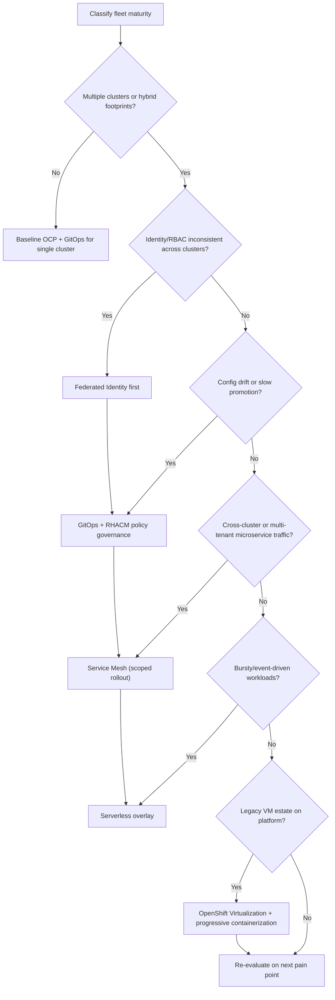

<!-- SPDX-License-Identifier: MIT -->
# OpenShift Hybrid Cloud — Design Patterns, Risks & Decision Framework

Synthesized from [IBM — OpenShift Virtualization on ARO](https://www.ibm.com/new/product-blog/enterprise-ready-hybrid-cloud-why-cios-choose-red-hat-openshift-virtualization)
and [MeatyBytes — Hybrid Cloud Design Patterns Part 1](https://meatybytes.io/posts/openshift/architecture/ocp-patterns/patterns-pt-1/).
Cross-check against current Red Hat/Azure product docs before implementation.

## Core principle

**Integrate legacy and cloud-native on a governed platform fabric — do not force a
big-bang rewrite.** Size platform complexity to fleet maturity; add patterns when
measured pain (identity sprawl, drift, cross-cluster traffic) exceeds pattern
overhead.

At T2 enterprise scale and above, hybrid OpenShift fleet governance becomes
mandatory — see `scaling-tiers.md`.

---

## Pattern catalog

### A. Modern hybrid patterns (OpenShift-specific)

| Pattern | Primary tooling | When to use | Key trade-offs |
|---------|-----------------|-------------|----------------|
| **Federated Identity** | AD, Keycloak, Azure AD/OIDC | ≥2 OCP clusters or hybrid on-prem+cloud; shared RBAC/audit | **Pro:** single credential lifecycle, centralized audit. **Con:** IdP SPOF; federation latency; token propagation complexity |
| **Service Mesh** | Istio, OpenShift Service Mesh (OSSM) | Microservices with cross-cluster or multi-tenant east-west traffic; need mTLS, canary, observability | **Pro:** uniform traffic/security policy. **Con:** operational overhead, sidecar resource tax, debugging complexity |
| **Multi-Cluster Management** | RHACM | Fleet lifecycle, policy governance, DR, app placement across clouds | **Pro:** hub-and-spoke ops at scale. **Con:** hub cluster criticality; policy blast radius; licensing |
| **GitOps** | Argo CD, OpenShift GitOps | Any env with drift risk; platform teams declaring cluster/app state | **Pro:** audit via Git, reproducible rollback. **Con:** secret handling in Git; sync lag; CRD ordering issues |
| **Serverless** | Knative, OpenShift Serverless | Variable/burst traffic; event-driven APIs; scale-to-zero acceptable | **Pro:** cost at low traffic, fast scale-out. **Con:** cold start; not for stateful/GPU/HPC workloads |
| **Unified VM+Container** | OpenShift Virtualization on ARO/OCP | VM estates with progressive containerization path | **Pro:** no forced rewrite; single control plane. **Con:** dual runtime ops during migration; storage/network bridging |

### B. Classic Kubernetes patterns (in hybrid context)

| Pattern | When to use | Trade-off summary |
|---------|-------------|-------------------|
| **Sidecar** | Logging, proxy, config sync per pod | Simple; multiplies containers and resource requests |
| **Ambassador** | Simplify external service access from pod | Hides complexity; extra hop |
| **Adapter** | Normalize metrics/protocols between containers | Decoupling cost vs. maintenance |
| **Leader Election** | HA operators/controllers | Requires correct lease semantics |
| **Work Queue / Scatter-Gather** | Parallel batch or request fan-out | Complexity in aggregation and failure partials |
| **Init Container** | Migrations, permissions, bootstrap before main | Extends pod startup time |

---

## Risk flags — designs going off-track

When reviewing a hybrid OCP design, **pinpoint these symptoms early** and confirm
a remedy plan before the pattern hardens into production debt.

| Pattern | Risk flag (symptom) | Future break scenario |
|---------|---------------------|----------------------|
| Federated Identity | Per-cluster local users still provisioned ad hoc | Audit gaps; orphaned accounts; failed compliance |
| Federated Identity | Long-lived cluster-admin kubeconfigs | Credential sprawl; undetected privilege escalation |
| Service Mesh | Mesh deployed before service inventory stable | mTLS breaks unknown clients; on-call mesh firefighting |
| Service Mesh | Every namespace meshed by default | Resource bloat; upgrade fragility across Istio/OSSM versions |
| RHACM | Policies applied before cluster baseline hardened | Remediation storms; false-positive compliance noise |
| RHACM | Hub treated as optional dev cluster | Fleet blind spot during hub outage |
| GitOps | Secrets or kubeconfigs committed to Git | Credential leak; irreversible audit incident |
| GitOps | Monorepo with no env promotion model | Production sync from unreviewed branch |
| Serverless | Stateful/GPU jobs on Knative | Data loss, scheduling failures, cost surprises |
| Serverless | No minimum replicas for latency-SLA APIs | Cold-start SLA violations |
| VM+Container unified | VMs migrated without dependency mapping | Hidden east-west deps break post-cutover |
| VM+Container unified | No wave plan for storage/network parity | Rollback impossible; extended dual-stack ops |

---

## Remedy and precaution plans

| Pattern | Precaution (design-time) | Remedy (when flagged) |
|---------|--------------------------|----------------------|
| Federated Identity | Mandate IdP-only RBAC; ban local admin except break-glass with TTL | Run access review; migrate local users to groups; enable SSO on all clusters |
| Service Mesh | Start with single mesh slice (one app line); inventory all clients first | Temporarily bypass mesh for failing svc; staged mTLS (PERMISSIVE → STRICT) |
| RHACM | Staging hub; policy tiers (inform → enforce); cluster labels for placement | Pause enforce policies; fix baseline; re-enroll clusters with corrected labels |
| GitOps | External Secrets / SealedSecrets; env branches or ApplicationSet generators | Rotate leaked creds; split repos by classification; add PR-required sync |
| Serverless | Define workload fit matrix (stateless API yes; batch/GPU no) | Move misfit workloads to Deployments/Jobs; set minScale for SLA paths |
| VM+Container | Dependency discovery before wave N (agentic AMM or manual) | Roll back wave; fix networking/storage; re-run assessment |

---

## Decision framework — next architectural choices

Use this **ordered gate** when standing up or evolving a hybrid OCP platform.
Stop at the first gate that resolves the current bottleneck; do not pre-install
all patterns.

### Gate questions (principal engineer checklist)

1. **Fleet size & placement** — How many clusters? Which clouds/on-prem? Need RHACM now or at N+2 clusters?
2. **Identity** — Is there already a corporate IdP? Are local cluster users still being created?
3. **Delivery** — Is Git the declared source of truth? Who can sync to production?
4. **Traffic** — Do services talk across cluster boundaries? Is mTLS required by policy or regulator?
5. **Workload fit** — Which apps are VM-bound, container-native, bursty, or GPU/HPC (likely outside serverless)?
6. **Modernization path** — Lift-and-shift vs. refactor vs. containerize per app (assessment tiers: as-is, refactor, containerize).

### Recommended sequencing (typical enterprise)

| Phase | Patterns | Rationale |
|-------|----------|-----------|
| 0 — Foundation | Hardened single/multi cluster OCP, baseline monitoring | Avoid building governance on weak baselines |
| 1 — Identity + GitOps | Federated Identity, OpenShift GitOps | Stops drift and account sprawl early |
| 2 — Fleet governance | RHACM policies, cluster lifecycle | Needed before mesh/serverless at scale |
| 3 — Cross-cutting traffic | OSSM (scoped) | After service inventory and GitOps stable |
| 4 — Elasticity | Serverless for fit workloads | After traffic patterns understood |
| 5 — Modernization | OpenShift Virtualization waves | Parallel track; do not block phases 1–2 |

---

## Integration with cluster-ops

- **Provider patterns** (`provider-patterns.md`) — ARO is the Azure managed OCP
  offering for unified VM+container; align identity with Azure AD where applicable.
- **Scheduler/fabric** — GPU/HPC and Slurm estates may coexist with OCP; serverless
  and mesh patterns apply to the Kubernetes slice, not the batch fabric.
- **IBM AMM modernization** — Agentic assessment (discover → map deps → wave plan)
  accelerates VM migration; do not skip dependency mapping for speed.

---

## Gaps needing human input

| Gap | Suggested owner |
|-----|-----------------|
| MeatyBytes Part 2/3 patterns not ingested | Platform architect |
| Corporate IdP choice (AD vs Keycloak vs Azure AD) | Identity/IAM team |
| RHACM hub placement and DR | Infra/SRE |
| GPU/HPC workload boundary vs OCP serverless/mesh | HPC + platform joint review |
| IBM AMM tooling vs in-house migration runbooks | Cloud transformation PM |
