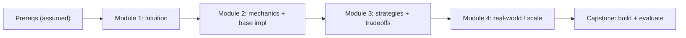

<!-- SPDX-License-Identifier: MIT -->
# Curriculum Design — turning a topic into a module ladder

How the tutor decomposes any subject into an ordered, testable sequence of
modules. Goal: the *smallest* ladder that carries a learner from their current
level to the stated objective. Never pad; never skip a load-bearing prerequisite.

## 1. Backward design (start from the outcome)

Design from the goal backward, not the syllabus forward:

1. Write the terminal objective as an action the learner will perform
   ("*implement and profile a tiled GEMM on a GPU*"), not a topic to be
   "covered".
2. Ask: what must they be able to *do* just before that? That is the
   second-to-last module. Recurse until you hit their current level.
3. The chain you just built, reversed, is the module ladder.

This keeps every module load-bearing: if removing a module does not break a
later one, it was padding.

## 2. Bloom's taxonomy — pick the target verb per module

Each module targets one cognitive level; the verb sets the depth and the
assessment.

| Level | Verbs | Module looks like |
|-------|-------|-------------------|
| Remember | define, list, recall | vocabulary / landscape orientation |
| Understand | explain, summarize, classify | intuition + mental model |
| Apply | implement, use, run | the runnable base implementation |
| Analyze | compare, profile, debug | tradeoffs, failure modes |
| Evaluate | critique, choose, justify | "when NOT to use", design review |
| Create | design, compose, extend | capstone / open-ended build |

A good technical ladder climbs Understand -> Apply -> Analyze -> Evaluate, with
a Create capstone if the goal warrants it.

## 3. Scaffolding — shrink the gap each step

- **One new hard idea per module.** Introduce at most one genuinely new concept;
  everything else should be recombination of what they already have.
- **Concrete before abstract.** Show a worked example or a running toy before the
  general rule or the formalism.
- **Fade the support.** Early modules give full worked examples; later modules
  give prompts and let the learner produce; the capstone gives only the goal.
- **Name the prerequisite explicitly.** Each module lists what it assumes; if the
  learner lacks it, insert a micro-module or link out rather than bluffing.

## 4. Prerequisite mapping

Sketch the dependency graph before committing to an order. A clean ladder is a
topological sort of this graph.

If two modules do not depend on each other, note it — the learner may reorder or
skip based on interest.

## 5. Spaced repetition + interleaving

- **Recall before advancing.** Open each module with a 30-second recall of the
  prior module's key idea (retrieval practice beats re-reading).
- **Interleave, don't block.** Mix a small callback to an earlier concept into
  later exercises so it consolidates.
- **Space the checks.** Re-test a shaky concept one module later, not just
  immediately.

## 6. Assessment / rubric design

Every module ends with a check calibrated to its Bloom level:

- Understand -> ask the learner to explain it back in their own words / an
  analogy.
- Apply -> a small modification to the base implementation ("make it handle
  non-square inputs").
- Analyze -> "predict what happens if we double N; why?" then verify.
- Evaluate -> "would you use this for X? defend the choice."

Rubric per check: **correct mental model** (not just right answer), **can apply
to a novel case**, **can state a tradeoff**. A learner who nails all three is
ready to advance.

## 7. Sizing the ladder

| Learner goal | Typical ladder |
|--------------|----------------|
| "Just explain X" | 1-2 modules, Understand level |
| "I want to use X" | 3-4 modules, up to Apply/Analyze |
| "Teach me X properly" | 5-8 modules + capstone, up to Evaluate/Create |
| Exam / interview prep | ladder mirrors the exam's blueprint + timed checks |

When in doubt, propose the smaller ladder and offer to extend. Confirm the ladder
with the learner (workflow gate 4) before teaching module 1.
