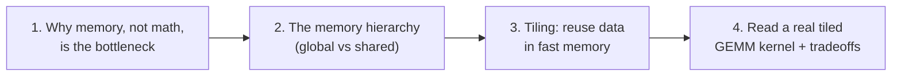
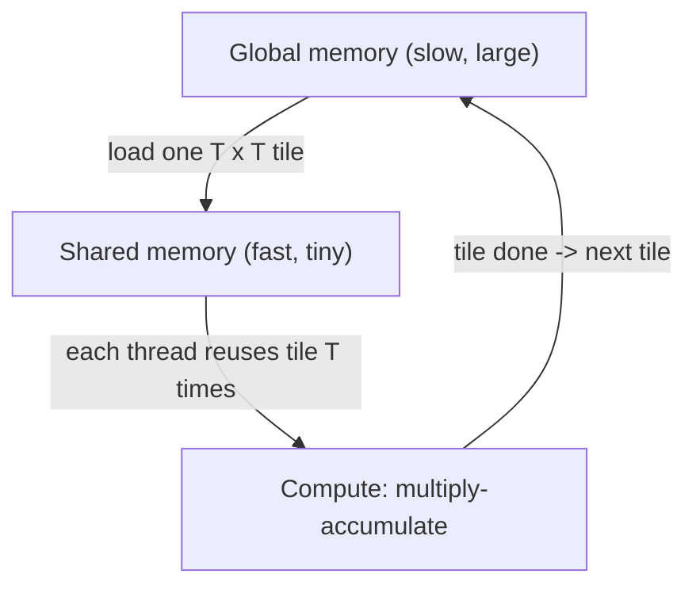

<!-- SPDX-License-Identifier: MIT -->
# Worked Example — teaching "tiled matrix multiply on a GPU"

A complete, condensed walkthrough of the tutor workflow for one topic, showing
the two-altitude style, the module ladder, one fully-taught module, and how the
interactive-canvas delivery option is used. This is an illustration of the
*shape* of a session, not a script to read verbatim to a learner.

## Gate 1-2 — scope + goal

> Learner: "Teach me why GPU matrix multiply uses 'tiling'. I can code in Python,
> I know what a matrix is, but I've never written a GPU kernel."

Assessed level: practitioner programmer, novice at GPU. Goal set with the
learner: *"Explain tiling from intuition to the point where you can read a tiled
GEMM kernel and say why it's faster, and modify a toy version."* Terminal Bloom
level: Analyze.

## Gate 3-4 — module ladder + format

Proposed ladder (confirmed with the learner):



Then, via `AskQuestion`: "How do you want module 3 (tiling) delivered?" Options:
text+mermaid (default) / interactive canvas / slides / image. Learner picks
**interactive canvas** for module 3 because it is the visual heart of the topic.

Routing note: modules 1-3 are general GPU-performance intuition the tutor teaches
directly; module 4 (reading a real HIP/CUDA kernel, occupancy, bank conflicts)
reaches the `cuda-contributor` / `rocm-contributor` gate and delegates that depth.

## Gate 5-9 — teaching Module 3 (abridged, using templates/module.md)

### Module 3 — Learner will be able to explain how tiling raises data reuse

**Intuition (ELI5).** Imagine copying a recipe from a library book. Walking to
the shelf for every single word (global memory) is absurdly slow. Instead you
photocopy one page (a *tile*) onto your desk (fast *shared memory*), use every
word on it many times, then fetch the next page. Tiling is "photocopy a block,
reuse it a lot, then move on." *Where the analogy breaks:* the desk is tiny and
shared by a whole team (a thread block), so tile size is a real constraint.

**Expert depth.** Naive GEMM reads each element of A and B from global memory
O(N) times, so it is memory-bandwidth-bound: arithmetic intensity (FLOPs per byte
moved) is low. Tiling loads a `T x T` block of A and B into shared memory once,
then each thread reuses those cached values for `T` multiply-adds before the next
load — raising arithmetic intensity ~`T`x and shifting the kernel toward
compute-bound. The classic reference is the CUDA C++ Best Practices Guide,
"Memory Optimizations".

**Visualize it (interactive canvas).** Because the learner chose a canvas, follow
the Cursor `canvas` skill and write one `.canvas.tsx` that shows an animated
`N x N` GEMM: a slider for tile size `T`, highlighting the tile currently in
shared memory, and a live counter of "global-memory reads: naive vs tiled". The
`.canvas.tsx` file is the editable source — the learner can change `N`, `T`, or
the color mapping and it recompiles beside the chat. (Fallback if canvas is
declined: the mermaid below.)



**Base implementation (runnable).** A NumPy toy that *counts* global reads to make
the win measurable without a GPU:

```python
import numpy as np

def naive_reads(N):
    # each C[i,j] reads N of A and N of B -> 2*N per output, N*N outputs
    return 2 * N * N * N

def tiled_reads(N, T):
    # each tile loaded once into "shared"; reused T times
    tiles = (N // T) ** 3
    return tiles * (2 * T * T)  # A-tile + B-tile per tile-step

N, T = 1024, 32
print("naive :", naive_reads(N))
print("tiled :", tiled_reads(N, T), f"(~{naive_reads(N)/tiled_reads(N,T):.0f}x fewer)")
```

**Implementation strategies.** (1) Move from counting to a real kernel in
HIP/CUDA with `__shared__` tiles and `__syncthreads()`. (2) Tune `T` to the
hardware (shared-memory size, warp/wavefront width). (3) Add register blocking so
each thread computes a micro-tile of outputs.

**Challenges / drawbacks / tradeoffs.**

| Challenge | Why | Mitigation |
|-----------|-----|------------|
| Wrong tile size tanks perf | too big -> low occupancy; too small -> poor reuse | tune `T`; start at 16/32, profile |
| Shared-memory bank conflicts | threads hit same bank | pad tile rows by 1 |
| Boundary tiles when `N % T != 0` | out-of-range reads | guard/pad edges |
| Sync overhead | `__syncthreads()` stalls | balance tile size vs sync count |

**Real-world use-cases.** rocBLAS/cuBLAS GEMM, the core of every dense NN layer;
attention's QK^T and AV matmuls in transformers. (Delegate kernel-level specifics
to `rocm-contributor` / `cuda-contributor`.)

**Comprehension check.** "If I double `T` from 16 to 32, what happens to global
reads, and what might get *worse*?" Good answer: reads roughly halve (more reuse);
occupancy and register/shared pressure may rise, so it is not monotonic — must
profile.

**Recap + next.** Tiling trades a little complexity for a large cut in slow memory
traffic by reusing a cached block. Next (Module 4) we read a real tiled kernel and
delegate the hardware-specific tuning to the GPU specialist skill.

## What this example demonstrates

- Two altitudes every time (recipe analogy *and* arithmetic-intensity framing).
- One module taught in depth, ladder shown once — token-efficient.
- A cited claim, a runnable base impl, an honest tradeoff table, a real check.
- The delivery-format gate driving an interactive canvas with an editable source.
- Routing: general intuition taught directly; hardware depth deferred to the
  `cuda-contributor` / `rocm-contributor` gate.
