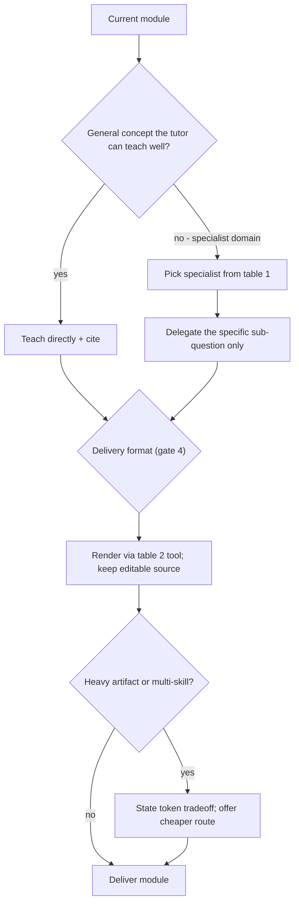

<!-- SPDX-License-Identifier: MIT -->
# Routing — mentor delegation + delivery-format map + token budget

The tutor is a router. It teaches what it can teach well directly, and delegates
depth to a specialist skill only when a module actually reaches that specialist's
turf. This file is the decision table.

## 1. Topic-domain -> specialist skill

Delegate the *depth* of a module (not the teaching frame) when the topic enters
one of these domains. Keep the tutor's job — intuition, scaffolding, checks — and
borrow the specialist's rigor for the technical core.

| Module domain | Delegate to | Trigger signals |
|---------------|-------------|-----------------|
| HPC / AI cluster design, fabric, scheduler, storage, scale | `cluster-ops` | interconnect, Slurm/K8s, checkpointing, exascale, GPU cluster sizing |
| AMD GPU programming, HIP/ROCm, build/release | `rocm-contributor` | HIP kernel, ROCm, gfx target, TheRock, amdgpu, rocBLAS/RCCL |
| NVIDIA GPU programming, CUDA, nvcc/PTX | `cuda-contributor` | CUDA kernel, nvcc, compute capability, cuBLAS, NCCL, cuda-samples |
| Architecture, security, ROI, licensing, packaging, GPU compute strategy | `principal-engineer` | scalability, threat model, SPDX/licensing, build-vs-buy |
| Service/package layout, connectors, config, state | `backend-architect` | service boundaries, async I/O, settings, transport |
| Data model, indexing, sharding, migrations, HA/DR | `database-architect` | schema design, query tuning, partition, replication |
| Cloud design/review (AWS / GCP / Azure) | `aws-/gcp-/azure-cloud-architect` | landing zone, VPC, IAM/Entra, well-architected |
| Firmware / UEFI / EDK II boot flow | `principal-uefi-engineer` | PEIM, DXE/SMM, ACPI, boot flow, edk2 |
| Agent/LLM pipelines, structured outputs, gateway | `ai-engineer` | agent graph, confidence threshold, rule-based-first |
| Readability / clean-code review, over-engineering audit | `clean-code` | story flow, abstraction value, find bloat |
| Requirements phrasing | `ears-requirements` | shall-statements, unambiguous requirement |
| Research paper / publication strategy | `research-publication-expert` / `paper-writer` | novelty, target venue, citation strategy |

**Rule:** invoke the specialist **at the gate**, once the current module needs
that depth — never load all specialists preemptively. If no specialist fits,
teach directly and cite from `citations.md`.

## 2. Delivery-format -> tool / skill

Chosen by the learner at workflow gate 4 (via `AskQuestion`). Details in
`delivery-formats.md`.

| Learner wants | Invoke | Notes |
|---------------|--------|-------|
| A quick explanation | inline text + mermaid | default; cheapest |
| A diagram / flowchart | inline mermaid | source is the fenced block |
| An interactive thing / mini-site / drawing | Cursor `canvas` skill | one `.canvas.tsx`; interactive widgets, charts |
| A deck / presentation | `slide-creator` (+ `theme-factory`) | `.pptx` with embedded editable source |
| A picture / illustration / concept art | `GenerateImage` tool | keep prompt + spec as editable source |
| A video | editable storyboard (+ canvas animation) | no native video gen; confirm scope first |

## 3. Token-budget heuristics

The mentor's promise is "best result on the route that makes sense" — not "most
tokens spent". Apply in order:

1. **Progressive disclosure.** Read a reference file only when the active gate
   needs it. `SKILL.md` alone handles most turns.
2. **One module at a time.** Never expand the whole ladder body up front; show
   the ladder, teach the current rung.
3. **Summarize + link.** Cite sources with a one-line takeaway and a hyperlink,
   not a pasted excerpt.
4. **Delegate narrowly.** When invoking a specialist, hand it the specific
   sub-question, not the whole topic.
5. **Reuse learner context.** Do not re-teach demonstrated knowledge; build on it.
6. **Escalate artifacts on demand.** Default to mermaid; produce a canvas / deck /
   image / storyboard only when the learner asks and after confirming for the
   heavy ones.
7. **Surface the tradeoff.** When a chosen route is expensive (big canvas, slide
   deck, image batch, multi-skill delegation), say so and offer the cheaper path.

## 4. Route-selection flow

