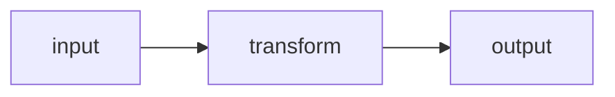

<!-- SPDX-License-Identifier: MIT -->
# Module Template

Fill this in for each module the tutor teaches. Keep prose tight — lead with the
plain answer and a diagram, expand only where it earns its place. Delete any
section that genuinely does not apply (but intuition, tradeoffs, and the check
are mandatory).

---

## Module N — <one-line objective, as a "learner will be able to..." action>

**Prerequisites:** <what this module assumes; link a micro-module if missing>
**Bloom level:** <understand | apply | analyze | evaluate | create>
**Delivery:** <text+mermaid (default) | canvas | slides | image | storyboard>

### 1. Intuition (ELI5)

The plain-language mental model — an analogy, no jargon. A smart 12-year-old
should follow this. Flag explicitly where the analogy breaks down.

### 2. Expert depth

The rigorous framing: precise terminology (defined on first use), the mechanism,
and math/spec *only where it clarifies*. This is what earns an expert's respect.
Cite the key claim with an inline link (see `citations.md`).

### 3. Visualize it

A mermaid diagram (default) or a note to render the chosen richer format
(canvas / slides / image / storyboard per `delivery-formats.md`). The diagram
source is editable.



### 4. Base implementation (runnable)

The minimal version the learner can execute — not production-padded. Readable
first; comment only non-obvious intent. State how to run it.

```text
# language-appropriate minimal, runnable example
```

### 5. Implementation strategies

How to go from the toy to something real: the 2-3 next steps, the knobs that
matter, and the order to add them.

### 6. Challenges, drawbacks & tradeoffs (mandatory)

Be honest. What breaks, what it costs, when NOT to use this.

| Challenge / drawback | Why it happens | Mitigation / action |
|----------------------|----------------|---------------------|
| <e.g. cost at scale> | <root cause>   | <what to do about it> |

### 7. Real-world use-cases

1-3 concrete places this is actually used (system, product, or paper), each with
a one-line "why it fits here" and a link where possible.

### 8. Comprehension check (mandatory)

1-3 questions or a small exercise calibrated to the Bloom level (see
`curriculum-design.md` §6). Include what a good answer looks like so the learner
can self-assess.

### 9. Recap + next

Two-sentence recap of the load-bearing idea, then the next module's objective and
how it builds on this one.
