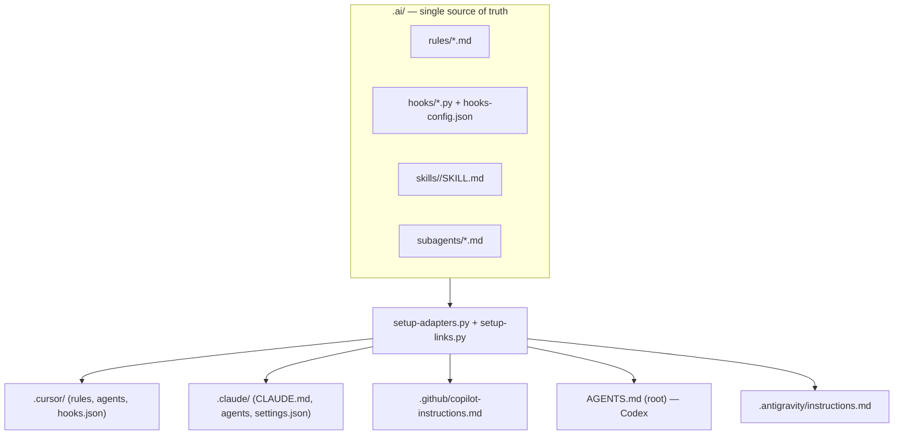

<!-- SPDX-License-Identifier: MIT -->

# AI-Ready Project Template

A portable, **GitHub template** repository that ships a single source of truth
for AI coding-assistant configuration. Author your rules, hooks, skills, and
subagents once in `.ai/`, then generate platform adapters for **Claude Code,
Cursor, GitHub Copilot, OpenAI Codex, and Google Antigravity**.

Everything here is generic and free of proprietary project, company, or product
names — fork it, rename `your_package`, and start building.

## Why this template

- **One source of truth.** No copy-paste drift across five tools' config files.
- **Four composable primitives.** Rules, hooks, skills, and subagents, each with
  a clear home and a clear contract.
- **Deterministic guardrails.** Hooks block `.env` access, lint on edit, scan for
  secrets/SPDX, and forecast token cost — independent of which assistant runs.
- **Portable skills.** Skills follow a universal format (`.ai/SKILL-FORMAT.md`)
  and are translated to each platform by `setup-adapters.py`.

## The four primitives



| Primitive | Lives in | Purpose |
|-----------|----------|---------|
| **Rules** | `.ai/rules/*.md` | Always-on conventions that constrain every change |
| **Hooks** | `.ai/hooks/*.py` | Deterministic guardrails fired on tool/agent events |
| **Skills** | `.ai/skills/<name>/SKILL.md` | Reusable, trigger-activated capability modules |
| **Subagents** | `.ai/subagents/*.md` | Composite agents that delegate to one or more skills |

## Repository layout

```
.ai/                      # Canonical source (edit here)
├── AGENTS.md             # Central instructions + index
├── SKILL-FORMAT.md       # Universal skill format spec
├── rules/                # python, security, git-commits, pr-budget, testing
├── hooks/                # guard-env, ensure-uv-env, lint, review, estimate, runner
├── hooks-config.json     # Budget / review / lint tunables
├── skills/               # 7 portable skills (see table below)
├── subagents/            # 3 composite subagents
├── setup-adapters.py     # Generates platform adapters
└── setup-links.py        # Links .ai/skills into .cursor/skills

# Generated adapters (do not edit by hand; regenerate instead):
AGENTS.md                 # OpenAI Codex + Google Antigravity entry
.cursor/                  # rules/*.mdc, agents/*.md, hooks.json
.claude/                  # CLAUDE.md, agents/*.md, settings.json
.github/copilot-instructions.md
.antigravity/instructions.md
```

## Quick start

1. **Use this template** on GitHub (or clone it) and rename `your_package`
   placeholders to your project name.
2. **Install tooling** (Python 3.11+ and [`uv`](https://github.com/astral-sh/uv)):
   ```bash
   pip install uv
   uv sync   # once you add a pyproject.toml
   ```
3. **Generate adapters** for every platform:
   ```bash
   python .ai/setup-adapters.py
   ```
4. **(Cursor only)** Expose skills to native discovery:
   ```bash
   python .ai/setup-links.py
   ```
5. Edit canonical files in `.ai/`, then re-run `setup-adapters.py`. Never edit the
   generated adapter files directly.

## Platform support matrix

| Platform           | Primary Config                    | Hooks                   | Skills            |
|--------------------|-----------------------------------|-------------------------|-------------------|
| Cursor             | `.cursor/agents/*.md`             | `.cursor/hooks.json`    | Reads SKILL.md    |
| Claude Code        | `.claude/CLAUDE.md`               | `.claude/settings.json` | Read tool         |
| GitHub Copilot     | `.github/copilot-instructions.md` | N/A                     | Inline summary    |
| OpenAI Codex       | `AGENTS.md` (root)                | N/A                     | Section headers   |
| Google Antigravity | `.antigravity/instructions.md`    | Slash commands          | Multi-agent       |

## Available AI skills

| Skill | Trigger phrases | Purpose |
|-------|-----------------|---------|
| `principal-engineer` | architecture, scalability, ROI, security, GPU | ROI/scale/security/licensing gates, GPU compute, packaging |
| `ai-engineer` | pipeline node, agent graph, confidence threshold, LLM call | Rule-based-first routing, structured outputs, gateway client |
| `backend-architect` | service layout, connector, transport, config, state | Package layout, async connectors, settings management |
| `clean-code` | readability, clarity, simplicity, story flow | Reader-mindset readability and abstraction-value review |
| `devops-automator` | CI/CD, Docker, deployment, secrets, pipeline | Container images, pipeline gates, secret hygiene |
| `code-reviewer` | code review, PR review, review this diff | 16-point checklist, commit hygiene, config↔docs parity |
| `test-quality-evaluator` | run tests, coverage, quality scoring, calibration | Test execution, quality matrix, regression and calibration |

## Available subagents

| Subagent | Composes | Use for |
|----------|----------|---------|
| `reviewer` | code-reviewer, clean-code | End-to-end review of a diff or PR |
| `architect` | backend-architect, principal-engineer | Design and scalability decisions |
| `release-engineer` | devops-automator, test-quality-evaluator | Build, test, and ship readiness |

## Hooks

Hooks live in `.ai/hooks/` and are wired into Cursor (`.cursor/hooks.json`) and
Claude Code (`.claude/settings.json`). They are cross-platform and stdlib-only.

| Hook | Fires on | Effect |
|------|----------|--------|
| `guard-env-files` | file read/write | Blocks access to `.env*` (fail-closed) |
| `ensure-uv-env` | shell exec | Verifies a `uv`-managed venv is active |
| `lint-changed-files` | file edit | `ruff` + `mypy` on changed lines (non-blocking) |
| `post-test-review` | shell exec (tests) | SPDX + secret scan (+ standards in `full` mode) |
| `pre-agentic-estimate` | prompt submit | Token-cost forecast with a budget gate |

Tune behavior in `.ai/hooks-config.json` or via environment overrides:

| Variable | Effect |
|----------|--------|
| `AI_HOOK_REVIEW_MODE=off` | Disable post-test review |
| `AI_HOOK_REVIEW_MODE=full` | Enable the full standards pass |
| `AI_HOOK_LINT_ENABLED=0` | Disable lint-on-edit |
| `AI_HOOK_BUDGET_MAX=10` | Raise the cost-approval threshold |

## Conventions

Project rules are modular under `.ai/rules/`: `python.md`, `security.md`,
`git-commits.md`, `pr-budget.md`, and `testing.md`. See `.ai/AGENTS.md` for the
full index.

## License

MIT — see [LICENSE](LICENSE).
